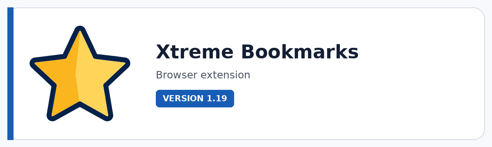

# Xtreme Bookmarks

**A serious bookmark workspace: search faster, organize visually, clean safely, preserve context, and keep large browser libraries under control.**

  

  

---

## Overview

Xtreme Bookmarks turns the browser's bookmark collection into an organized working library instead of a growing pile of links. It combines fast search, favorites, tags, notes, statuses, a configurable in-page sidebar, folder colors, maintenance tools, backups, and import/export workflows in one focused extension.

It is especially useful for researchers, creators, developers, consultants, knowledge workers, and anyone who saves enough links that the default bookmark manager starts becoming friction. Xtreme Bookmarks is designed to help you find what matters, understand why you saved it, and clean the library without losing control.

## Key features

- **Smart search and filtering** with folder-aware search, tags, reusable filters, result paths, and large-library search behavior.
- **Favorites, private notes, tags, and reading statuses** such as Read later, Reading, Done, and Important for turning bookmarks into a lightweight knowledge workflow.
- **Configurable in-page sidebar** with left/right placement, resize controls, quick access, and a more immediate way to browse while you work.
- **Visual folder organization** with an extensive color palette, subfolder color application, separators, sorting, and tree controls.
- **Backup-first maintenance tools** for de-duplication, duplicate-folder merging, empty-folder cleanup, separator cleanup, and URL maintenance.
- **Broken-link checking** with explicit handling for unreachable URLs, timeouts, and selected cleanup actions.
- **HTML import/export plus settings transfer** so bookmark libraries and extension preferences are easier to move, archive, and recover.

## Standout tools and workflows

| Tool / workflow | Why it matters |
|---|---|
| **Smart Search** | Search globally or within a folder and use tags/filters to reach saved information faster. |
| **Favorites + Status** | Promote important links and track lightweight states such as Read later, Reading, Done or Important. |
| **Bookmarks Sidebar** | Open a resizable bookmark workspace directly over the page without leaving your browsing context. |
| **Smart De-duplicate** | Review duplicate groups deliberately and decide which copy to keep before cleanup. |
| **Merge Duplicate Folders** | Combine same-name folders in the same location while preserving a safer cleanup workflow. |
| **Broken Links Checker** | Scan bookmark URLs and review unreachable links before removing anything. |
| **Folder Colors** | Use a broad color system to make large bookmark trees easier to scan visually. |
| **HTML + Settings Transfer** | Import/export bookmarks and move extension preferences between browser setups. |

## Product status

| Item | Details |
|---|---|
| Status | **Current release** |
| Version | 1.19 |
| Product type | Browser extension |
| Browsers | Chromium / Edge / Firefox |
| Best for | Research, knowledge work, large bookmark libraries, personal information organization |

## Media

Additional screenshots and workflow previews are coming soon.

## Documentation and support

| Resource | Link |
|---|---|
| Support guide | [SUPPORT.md](SUPPORT.md) |
| Repository changelog | [CHANGELOG.md](CHANGELOG.md) |
| Issues | [Open or review issues](https://github.com/pacosalasv/Xtreme_Bookmarks-Support/issues) |
| Discussions | [Ask questions and share feedback](https://github.com/pacosalasv/Xtreme_Bookmarks-Support/discussions) |

## Support development

If this tool saves you time, Ko-fi support helps fund maintenance, compatibility work, documentation, testing, and continued development.

  

## Ecosystem

| Destination | Link |
|---|---|
| Xtreme Mindset | [Product lab and experimentation](https://xtrememindset.blogspot.com/) |
| Paco Salas \| DRH | [Software, automation, 3D, AI, and product work](https://pacosalasv.blogspot.com/) |
| KreaOn | [Applied technology education](https://www.kreaon.com/) |
| DRH Blender Tools | [Browse Blender tools on BlendKit](https://www.blendkit.com/?query=author_id:205846) |
| Ko-fi | [Support development](https://ko-fi.com/pacosalasv) |

## License

Licensing and usage terms are provided with the current Xtreme Bookmarks distribution.
